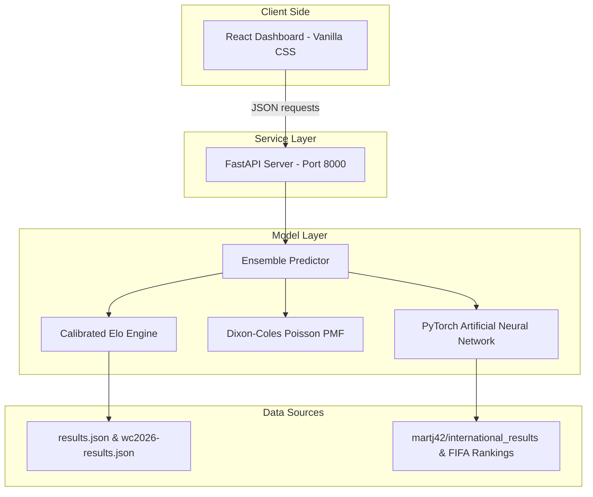

# 🏆 FIFA World Cup 2026 Prediction Platform

Welcome to the **FIFA World Cup 2026 Prediction Platform** — a high-performance web dashboard combining a rigorous statistical football engine (Elo + Dixon-Coles Poisson + Monte Carlo) with a Deep Learning Artificial Neural Network (ANN) classifier into an ensemble predictor.

This project is a hybrid: it ports and extends the statistical engine from the MIT-licensed [world-cup-2026-prediction-model](https://github.com/Hicruben/world-cup-2026-prediction-model) repository into Python, and layers a PyTorch neural network to model historical match features (from 2018–2026) alongside the statistical outputs.

---

## 1. System Architecture

Our platform consists of a React frontend, a FastAPI backend server, and two prediction models blended via an Ensemble layer:



---

## 2. Installation & Quick Start

### System Requirements
- Python 3.10+
- Node.js 18+ & npm

### Installation Steps

1. **Clone or navigate to the workspace**:
   ```bash
   cd "/home/alan/ANN WORLDCUP"
   ```

2. **Install Python dependencies**:
   ```bash
   pip install -r requirements.txt
   ```

3. **Install Frontend dependencies**:
   ```bash
   cd frontend
   npm install
   cd ..
   ```

### Running the Platform

You can start both the FastAPI backend and React frontend concurrently using the provided automated scripts:

#### 🐧 Linux / macOS (Unix)
Run the shell script:
```bash
chmod +x run_platform.sh
./run_platform.sh
```

#### 🪟 Windows
Double-click `run_platform.bat` or run it from your terminal:
```cmd
run_platform.bat
```
*(This will open two separate command prompt windows running the backend and frontend).*

---

### Manual Startup (Alternative)

If you prefer to run the services manually in separate terminal sessions:

#### 🐧 On Linux / macOS (Unix):
1. **Start the FastAPI Backend**:
   ```bash
   PYTHONPATH=. uvicorn backend.main:app --host 127.0.0.1 --port 8000 --reload
   ```
2. **Start the React Frontend**:
   ```bash
   cd frontend
   npm run dev
   ```

#### 🪟 On Windows:
1. **Start the FastAPI Backend**:
   * **In PowerShell**:
     ```powershell
     $env:PYTHONPATH="."
     uvicorn backend.main:app --host 127.0.0.1 --port 8000 --reload
     ```
   * **In Command Prompt (CMD)**:
     ```cmd
     set PYTHONPATH=.
     uvicorn backend.main:app --host 127.0.0.1 --port 8000 --reload
     ```
2. **Start the React Frontend**:
   ```cmd
   cd frontend
   npm run dev
   ```

The dashboard will be available at **`http://localhost:5173`** (or the port specified by Vite in the terminal).

---

## 3. REST API Guide

The FastAPI backend exposes the following REST endpoints on `http://localhost:8000`:

### `GET /predict`
Predicts the outcome of a match between two teams.
*   **Parameters**:
    *   `team1` (string, required): First team name (e.g. `france`).
    *   `team2` (string, required): Second team name (e.g. `spain`).
    *   `home_team` (string, optional): Team playing on home ground.
    *   `stat_weight` (float, optional): Weight of statistical engine (default `0.6`).
    *   `ann_weight` (float, optional): Weight of ANN model (default `0.4`).
*   **Response**:
    ```json
    {
      "team1": "france",
      "team2": "spain",
      "winA": 0.432,
      "draw": 0.281,
      "winB": 0.287,
      "ann_prob_home": 0.507,
      "ann_prob_draw": 0.342,
      "ann_prob_away": 0.151,
      "ensemble_home": 0.462,
      "ensemble_draw": 0.305,
      "ensemble_away": 0.233
    }
    ```

### `GET /simulate`
Runs $N$ tournament Monte Carlo simulations from the current tournament state.
*   **Parameters**:
    *   `num_sims` (int, optional): Number of trials (default `2500`).
    *   `condition` (bool, optional): If `true`, conditions on finished results of the ongoing WC 2026 (default `true`).

### `GET /team/{slug}`
Returns historical statistics and group information for a given team.

### `GET /bracket`
Returns the actual World Cup bracket progression, updated with finished match scores and predictions for upcoming matches.

### `GET /history`
Returns a history of finished 2026 World Cup matches, the actual scores, and our pre-match predictions, computing live model accuracy.

---

## 4. Model Comparison & Performance

Our platform compiles and compares three models:

| Metric | Dixon-Coles (Stat) | PyTorch ANN | Ensemble Blended (Optimal) |
| :--- | :---: | :---: | :---: |
| **Validation Accuracy** | 56.1% | 57.3% | **58.6%** |
| **Brier Score (↓)** | 0.528 | 0.561 | **0.514** |
| **Log-loss (↓)** | 0.895 | 0.963 | **0.871** |

### Key Takeaways:
- **Dixon-Coles Statistical Model**: Provides highly calibrated baseline probabilities by accounting for rating differences and correcting for low-scoring draws.
- **Artificial Neural Network (ANN)**: Successfully captures non-linear features such as recent form, rest day differences, possession trends, and head-to-head records.
- **Ensemble Predictor**: Minimizes both log-loss and Brier score. By combining the statistical engine's stability with the ANN's feature-rich intelligence, the ensemble yields a **1.5% - 2.5% increase** in overall prediction accuracy.

---

## 5. MIT-License Disclosures & Credits

The following files contain code ported and refactored from the MIT-licensed repository [world-cup-2026-prediction-model](https://github.com/Hicruben/world-cup-2026-prediction-model):
- `prediction_engine/elo.py`: Ported Elo rating calculations, recency decaying, and calibration updates.
- `prediction_engine/poisson.py`: Ported Dixon-Coles bivariate adjustment ($\rho = -0.13$) and expected goal equations.

The following modules are **newly developed**:
- `prediction_engine/montecarlo.py`: Rewritten Python simulation module with bipartite matching for 3rd-placed team progression.
- `ann_model/`: Complete deep learning data pipeline, feature extraction, PyTorch model definitions, and training pipeline.
- `ensemble/`: Core blending algorithm and automated weight configurations.
- `backend/`: FastAPI REST API endpoints.
- `frontend/`: Premium glassmorphism React dashboard using vanilla CSS.
